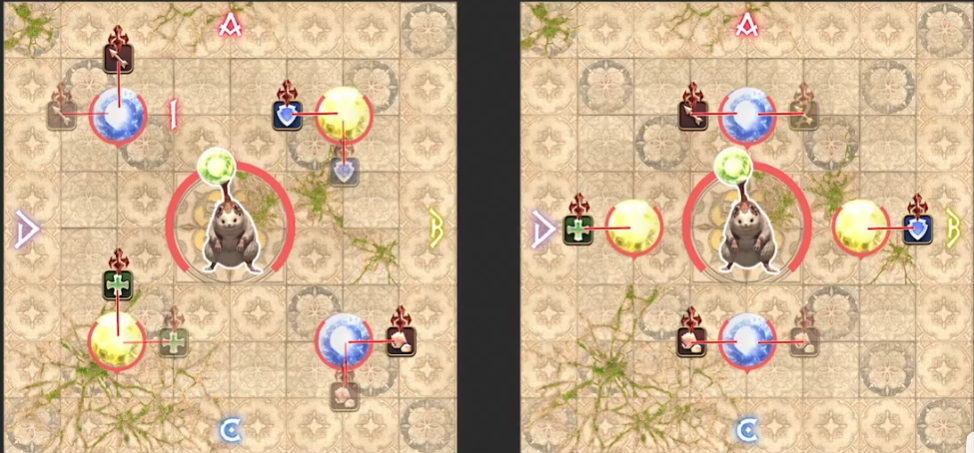
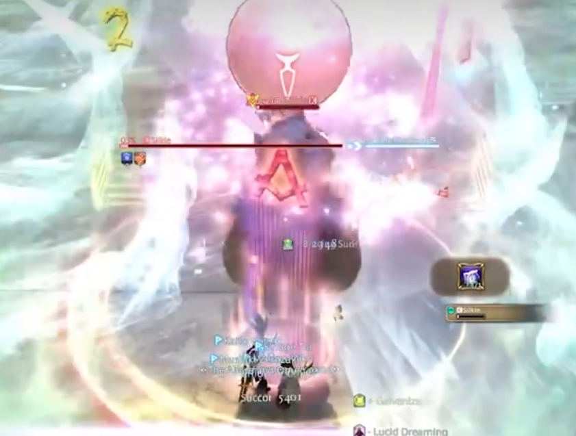

# 異聞シラディハ

ベースはハムカツ式です。

## １ボス シルキー

ポンポン創出４玉引っ張り１回目

Game8カンペでもいいですが、もっと簡単な記憶法があります。

真ん中風の場合、氷は隅へ（角ではない）、雷はABCDマーカーの方向へ誘導、X字十字左右雷など気にしなくて大丈夫です。こうすれば安置は必ず真ん中にあります。

(破線はどっちも可）

真ん中氷の場合、どちらも脳死でボスから遠い方向へ誘導。十字の場合はABCDマーカーへ、X字の場合は斜め角へ。

安置は図の通りです。十字の場合だけ近接組ややシビアのように見えますが実際かなり余裕があります。

ポンポン創出４玉引っ張り２回目

１２マーカー間待機

半面焼き判断できたら安置側のマーカーに駆け込む

誘導できたら移動、安置はボス正面

## ２ボス シラディハグラディアトル

呪怨の咆哮

タンク北ヒラ南近接東遠隔西（相談可）の安置で予め散開。インタベやバリアなどでケアしてれば一人で頭割りを受けられます。他は一緒です。

＊これに関してはやれと言わないです、単純に事故を大幅減らせられるやり方として紹介してます。おすすめです。

## ３ボス ゼレズガー

呪具３脳死 動画通りです

参考：[めるさんのX](https://twitter.com/phil_ff14/status/1582745351110692864?s=20&t=ESktY5rjzNEMLOiPGDzX5A)

一点補足として、動画のマーカーだとギリギリ当たる可能性あるのでほかのマーカー出します（相談可）、この場合は真北／真南の斧の正面とマーカーに立ちます。

呪具４無敵 

処理自体は基本動画通りです、呪具処理終わったあとの天の聖火ですが、呪具処理にランダム性があり、相方見つけにくい場合もあるので、タンク無敵でボスの足元、他はタンクの後ろで受けることで事故かなり減ると思います。

呪具５固定

参考：[攻略見る趣味さんのX](https://twitter.com/mitsurugi137/status/1586003333206024192)

北西：T　北東：H　南西：D1　南東：D2

